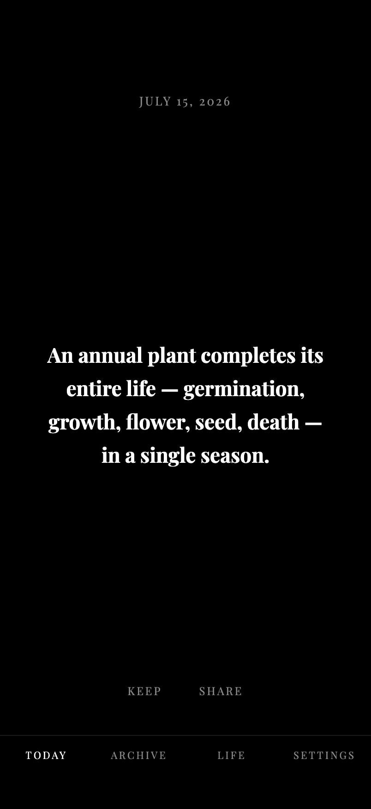
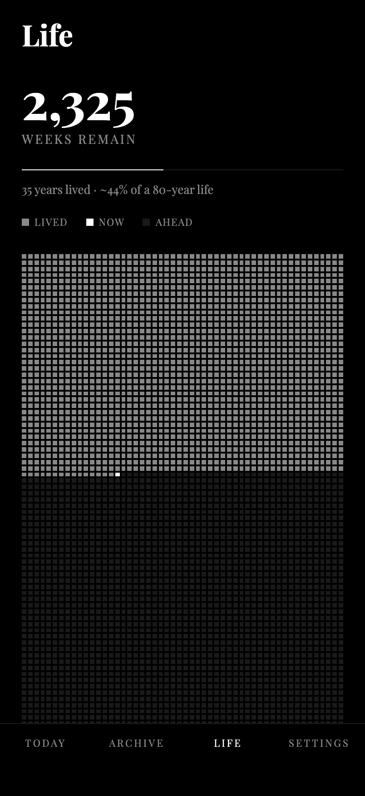
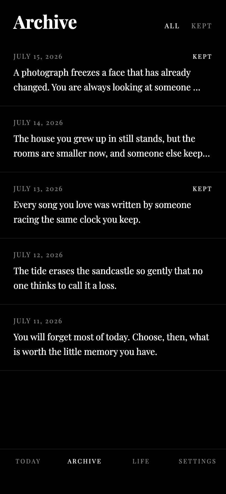

# Dying Daylight

**Each day, one reminder of something that will not last.**

A quiet mobile app that delivers a single daily reflection on impermanence — a relationship, a season, a phase of life, a sensation — as a gentle memento mori.


## Screenshots

<p align="center">
  
  &nbsp;&nbsp;
  
  &nbsp;&nbsp;
  
</p>

<p align="center"><em>Today &nbsp;·&nbsp; Life in Weeks &nbsp;·&nbsp; Archive</em></p>

## The Idea

Most of what we love is temporary. The child who holds your hand crossing the street will one day cross streets in a city you have never visited. The last warm evening of autumn arrives without announcement. The face in your bathroom mirror changes so slowly that you need old photographs to see the distance traveled.

Dying Daylight surfaces one of these truths each day. Not to sadden, but to sharpen attention. The things most worth noticing are the things that will not last.


## What It Does

- **One reflection per day** — displayed on a black screen in white serif type
- **1,000 curated reflections** built in, spanning seasons, childhood, relationships, aging, places, nature, work, food, dreams, identity, and mortality
- **AI-generated reflections** via the Claude API (optional — works beautifully without it)
- **Life in Weeks** — a memento mori laid out as a grid of weeks: one row per year of your expected lifespan, one dot per week lived and per week that remains
- **Keep** the reflections that land, and revisit them under a **Kept** filter in the Archive
- **Share** any reflection to Messages, Notes, or anywhere else
- **Daily notifications** at a time you choose
- **Archive** of every past reflection, expandable with a tap
- **Swipe** through past days on the home screen


## Design

Stark black and white. Playfair Display. No icons, no illustrations, no gradients. A slow daylight fade as each reflection appears, and reduced-motion is respected. The words do the work.


## Tech

- React Native + Expo (SDK 54)
- TypeScript (strict)
- Expo Router (file-based navigation)
- Expo Notifications (daily local reminders)
- Expo SecureStore (the API key is encrypted on-device)
- AsyncStorage (reflections and preferences stay on your device)
- Claude API (`claude-opus-4-8`) via direct `fetch` — no SDK required
- Jest + jest-expo for the test suite


## Getting Started

```bash
# Install dependencies
npm install

# Run in development
npx expo start

# Run the tests
npm test

# Build APK (Android)
npx expo run:android --variant release

# Build with EAS (cloud)
eas build --platform android --profile preview
```

Scan the QR code with **Expo Go** on your phone, or press `i` / `a` in the terminal for simulators.


## Project Structure

```
app/(tabs)/           Screens: Today, Archive, Life, Settings
lib/                  Core logic
  ├─ anthropic.ts     Claude API call
  ├─ reflections.ts   Daily selection + prefetch
  ├─ shuffle.ts       Seeded shuffle + date→index mapping (pure)
  ├─ life.ts          Life-in-weeks math (pure)
  ├─ storage.ts       AsyncStorage + SecureStore persistence
  ├─ secureStorage.ts SecureStore wrapper (web fallback)
  ├─ notifications.ts Daily local notifications
  ├─ share.ts         OS share sheet
  ├─ haptics.ts       Safe haptic feedback
  └─ date.ts          Date helpers (pure)
data/                 1,000 curated reflections
components/           ReflectionCard, ReflectionListItem
hooks/                useReflections, useSettings
__tests__/            Unit tests for the pure logic and storage
```


## How It Works

1. **On open**, the app checks whether today already has a reflection
2. If an API key is set, it generates one with Claude. If not (or if the call fails), it picks from the curated list
3. The curated pick is deterministic per device: a seeded Fisher–Yates shuffle gives each device a stable order, and the calendar date maps to a position in it — enough for nearly three years of unique daily content before anything repeats
4. Tomorrow's reflection is **prefetched in the background** so the notification contains the actual text
5. All reflections are cached locally and never lost


## Privacy

Everything stays on your device. The API key is stored with Expo SecureStore (Keychain on iOS, Keystore-backed encryption on Android). Nothing is sent anywhere except direct API calls to `api.anthropic.com` when a key is provided.


## Testing

The pure logic — date math, the seeded shuffle and its date-to-index mapping, and the life-in-weeks calculations — is covered by unit tests, alongside storage behavior (round-tripping, the plaintext-key migration, and favorites) with AsyncStorage and SecureStore mocked.

```bash
npm test
```


*The daylight dies. You remain. For now, this is everything.*
