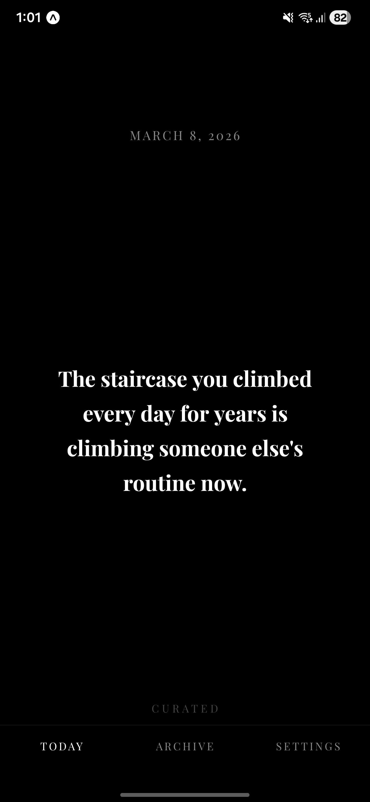
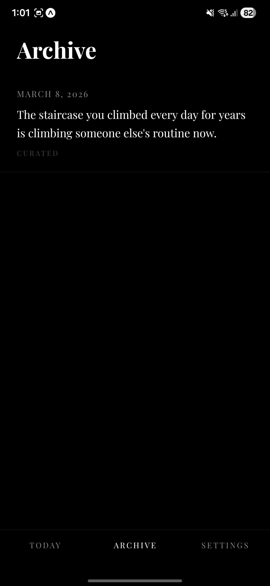
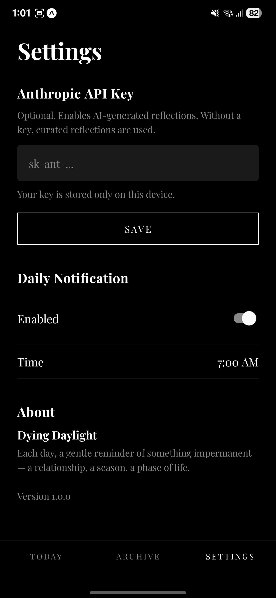

# Dying Daylight

**Each day, one reminder of something that will not last.**

A quiet mobile app that delivers a single daily reflection on impermanence — a relationship, a season, a phase of life, a sensation — as a gentle memento mori.


## Screenshots

<p align="center">
  
  &nbsp;&nbsp;
  
  &nbsp;&nbsp;
  
</p>

## The Idea

Most of what we love is temporary. The child who holds your hand crossing the street will one day cross streets in a city you have never visited. The last warm evening of autumn arrives without announcement. The face in your bathroom mirror changes so slowly that you need old photographs to see the distance traveled.

Dying Daylight surfaces one of these truths each day. Not to sadden, but to sharpen attention. The things most worth noticing are the things that will not last.


## What It Does

- **One reflection per day** — displayed on a black screen in white serif type
- **1,000 curated reflections** built in, spanning seasons, childhood, relationships, aging, places, nature, work, food, dreams, identity, and mortality
- **AI-generated reflections** via the Claude API (optional — works beautifully without it)
- **Daily notifications** at a time you choose
- **Archive** of every past reflection, expandable with a tap
- **Swipe** through past days on the home screen


## Design

Stark black and white. Playfair Display. No icons, no illustrations, no gradients. The words do the work.


## Tech

- React Native + Expo (SDK 54)
- TypeScript
- Expo Router (file-based navigation)
- Expo Notifications (daily local reminders)
- AsyncStorage (all data stays on your device)
- Claude API via direct fetch (no SDK required)


## Getting Started

```bash
# Install dependencies
npm install

# Run in development
npx expo start

# Build APK (Android)
npx expo run:android --variant release

# Build with EAS (cloud)
eas build --platform android --profile preview
```

Scan the QR code with **Expo Go** on your phone, or press `i` / `a` in the terminal for simulators.


## Project Structure

```
app/                  Screens (Today, Archive, Settings)
lib/                  Core logic (API, storage, notifications)
data/                 1,000 curated reflections
components/           ReflectionCard, ReflectionListItem
hooks/                useReflections, useSettings
```


## How It Works

1. **On open**, the app checks if today has a reflection
2. If an API key is set, it generates one with Claude. If not (or if the call fails), it picks from the curated list
4. Tomorrow's reflection is **prefetched in the background** so the notification contains the actual text
5. All reflections are cached locally and never lost


## Configuration

The API key is optional. Without it, the app draws from 1,000 curated reflections — enough for nearly three years of unique daily content. With a key, Claude generates fresh meditations on impermanence, falling back to curated if the network is unavailable.

Settings are stored on-device. Nothing is sent anywhere except direct API calls to `api.anthropic.com` when a key is provided.


*The daylight dies. You remain. For now, this is everything.*
